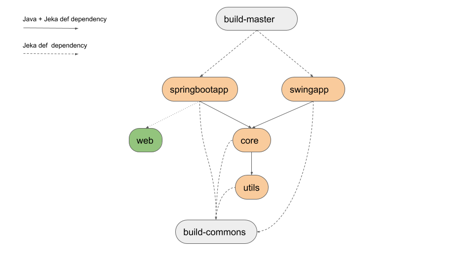

# Springboot multi module example

## Purpose
This project showcases how to a organise multi-module project with Jeka and especially a project integrating Springboot 
with pure client web application. It also demonstrates how to share common build features amongs multiple modules and to 
drive the whole build.

## What is inside ?

This project contains two applications providing the same functionality : compute a magic formula according an input number.
One application is a standalone Swing application while the other is web2 application hosted in a Springboot application.

The formula computation is provided by _core_ modules that in turns depends on  _utils_ as described below.

 

* [core](./core) : Library that actually compute the "magic formula". It uses in turn the [utils](./utils) lib to accomplish some parts of the computing.

* [swingapp](./swingapp) : Standalone swing application exposing _magic formula_. Jeka produces a fat jar containing all needed dependencies.

* [springbootapp](./springbootapp) : Springboot application exposing _magic formula_. Jeka triggers client part ([web](./web)) build to include it in _springbootapp.jar_ 

* [web](./web) : Web graphical interface embedded in _springbootapp_. This is a pure web project, built with _nodjs/npm/webpack_ without any trace of Jeka.

* [build-master](./build-master) : Contains only Jeka commands to trigger overall build.

* [build-common](./build-master) : Contains only Jeka commands to trigger overall build. 
Note that this could have also been included in the _utils_ module, which is the most downstream module, instead of a specific module. 


## How to build

**Note :** _Node.js + npm_ must be installed on the hosting machine in order to build [web](./web) module.

### Build all

```
cd build-master
jeka build
```

### Build springbootapp only

```
cd springbootapp
jeka cleanPack
```
To run the built instance : `jeka run`

### Build swingapp only

```
cd swingapp
jeka cleanPack
```
To run the built instance : `jeka run`
